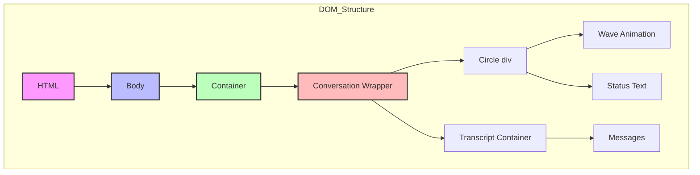
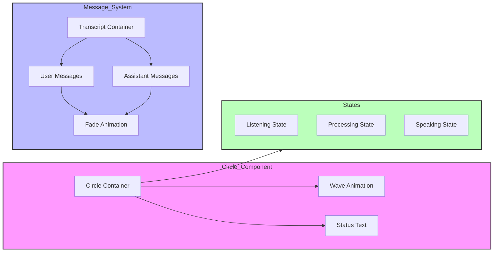
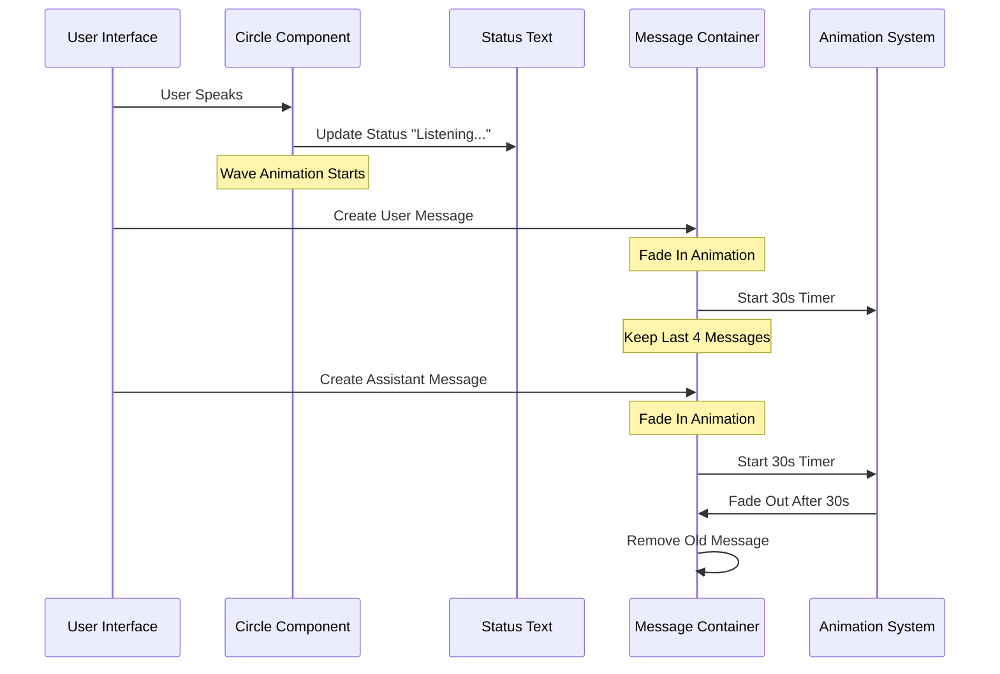
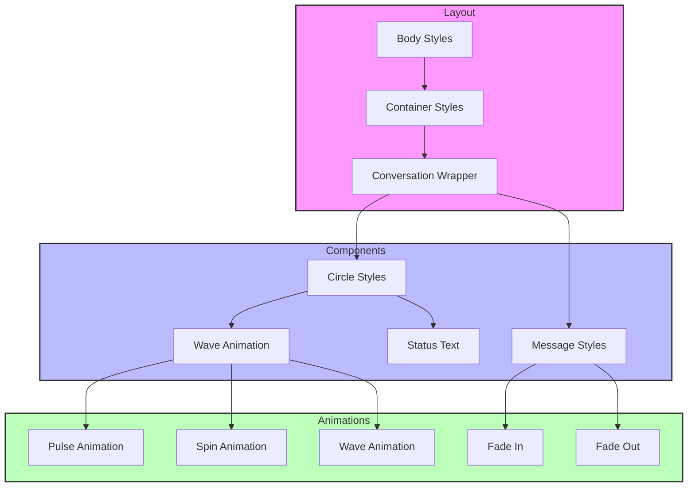

# RailVoice Assistant

A cutting-edge AI-powered voice assistant developed for the ElevenLabs AI Hackathon 2024, designed to revolutionize railway travel assistance and station announcements.

## Project Overview

RailVoice Assistant addresses the critical need for seamless, intuitive railway information access and automated station announcements. By leveraging advanced AI technologies, it provides natural voice interactions for railway queries and real-time announcements, making train travel more accessible and efficient for everyone.

### Problem Statement

Railway tourists and travelers often face challenges in:
- Getting real-time train information
- Understanding station announcements
- Checking PNR status and seat availability
- Navigating complex railway systems in unfamiliar locations

RailVoice Assistant solves these problems by providing an intuitive voice interface that handles queries naturally and makes clear, timely announcements for upcoming and ongoing trains at stations.

## Team Information

- **Anshu K.** - Lead Developer & Project Architect
  - Conceptualized and developed the entire solution
  - Implemented AI integration and voice processing
  - Designed the system architecture
  - Developed the backend services and API integrations

## UI Architecture

### HTML Structure



### UI Components



### Message Display Flow



### CSS Styling Structure



### Message Display Flow


## Technical Architecture

### System Architecture


### Voice Input Processing
- ElevenLabs Voice AI for speech-to-text
- Real-time audio streaming
- WebSocket communication for low-latency interactions

### Natural Language Understanding
- OpenAI GPT-4 for query understanding
- Intent classification and entity extraction
- Context-aware response generation

### Backend Services
- Flask server with WebSocket support
- Async request handling
- Robust session management
- Scalable architecture

### API Integration
- IRCTC API for real-time train data
- ElevenLabs API for voice synthesis
- OpenAI API for natural language processing

### Data Processing Pipeline


## Workflow


## Technology Stack

### Frontend
- HTML5, CSS3, JavaScript
- WebSocket client for real-time communication
- Audio streaming capabilities
- Responsive design for multiple devices

### Backend
- Python 3.x
- Flask & Flask-SocketIO
- Async/await support
- Session management
- Error handling and logging

### AI/ML Components
- OpenAI GPT-4 API for natural language understanding
- ElevenLabs Voice AI for speech synthesis
- Custom NLP models (future scope)

### Data Sources
- IRCTC RapidAPI for train information
- Station database
- Train schedules API
- Real-time updates integration

### Development Tools
- Git for version control
- VSCode IDE
- Python virtual environment
- Environment configuration

## Global Scalability

RailVoice Assistant is designed to be scalable for railway systems worldwide:

### Multi-Language Support
- ElevenLabs' multi-language capabilities
- Localized response generation
- Regional accent support

### API Integration Framework
- Modular design for different railway systems
- Standardized data format
- Easy integration with new providers

### Cloud Deployment
- Container-ready architecture
- Load balancing support
- Geographic distribution

### Customization Options
- Station-specific configurations
- Regional announcement patterns
- Custom voice and language settings

## Features & Capabilities

1. Natural Language Queries
   - Train schedules
   - PNR status
   - Seat availability
   - Platform information
   - Fare enquiries

2. Real-Time Information
   - Live train status
   - Delay notifications
   - Platform changes
   - Emergency updates

3. Station Announcements
   - Automated train arrival/departure
   - Safety announcements
   - Emergency broadcasts
   - Service updates

4. Voice Interaction
   - Natural conversation flow
   - Context awareness
   - Multi-turn dialogues
   - Error recovery

## Future Enhancements

1. Advanced Features
   - Ticket booking integration
   - Personalized travel recommendations
   - Journey planning assistance
   - Multi-modal transport integration

2. Technical Improvements
   - Offline mode support
   - Enhanced noise reduction
   - Improved context handling
   - Battery optimization

3. Integration Possibilities
   - Mobile app development
   - Smart speaker integration
   - Digital signage systems
   - IoT device connectivity

## Getting Started

### Prerequisites
- Python 3.x
- PyAudio (required for voice input)
- API keys for:
  - ElevenLabs
  - OpenAI
  - RapidAPI

### Installation

1. Clone the repository
2. Install dependencies:
   ```bash
   pip install -r requirements.txt
   ```
   
   Note: On Linux, you might need to install portaudio first:
   ```bash
   sudo apt-get install python3-pyaudio
   ```

3. Set up environment variables in `.env`:
   ```env
   # API Keys
   ELEVEN_LABS_API_KEY="your_elevenlabs_key"
   OPENAI_API_KEY="your_openai_key"
   RAPIDAPI_KEY="your_rapidapi_key"

   # Server Configuration
   API_ENDPOINT=http://localhost:5000/query
   PORT=5000
   DEBUG=True

   # Voice Assistant Configuration
   DEBUG_MODE=True  # Set to False for production
   VOICE_DEBUG=True  # Set to False for production

   # Timezone
   TZ=Asia/Kolkata

   # API Configuration
   MAX_RETRIES=3
   TIMEOUT_SECONDS=30
   ```

4. Run the server:
   ```bash
   python server.py
   ```

5. Access the application at `http://localhost:5000`

### Dependencies
- Flask & Flask-SocketIO for web server
- ElevenLabs for voice synthesis
- OpenAI for natural language processing
- PyAudio for voice input
- Arrow & Dateparser for date handling
- Additional utilities: psutil, pytz

## Contributing

We welcome contributions to improve RailVoice Assistant. Please feel free to submit issues and pull requests.

## License

This project is part of the ElevenLabs AI Hackathon 2024. All rights reserved.
